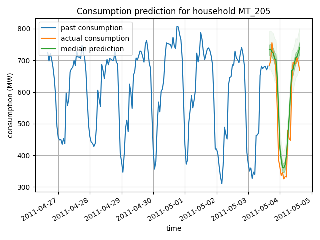
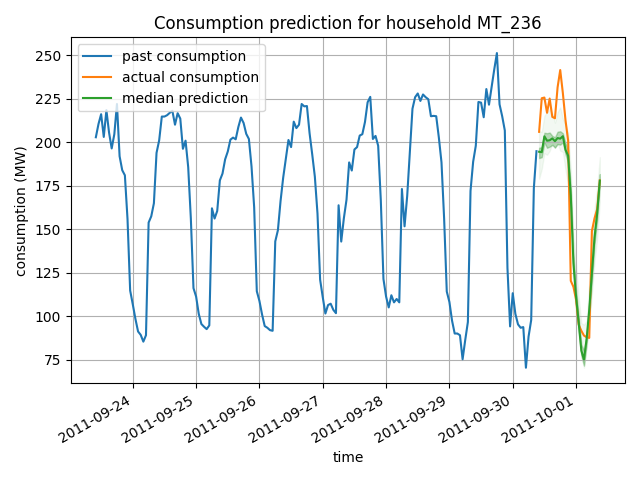
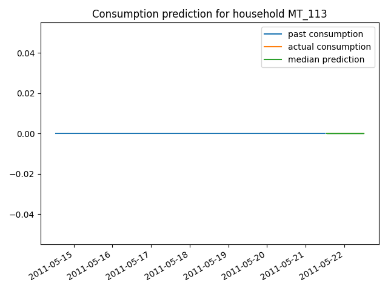
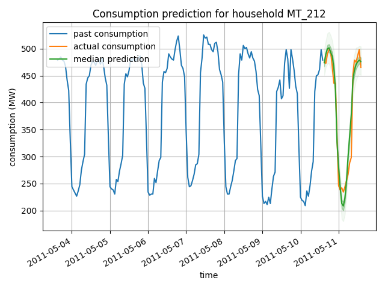

# Multi-Horizon Quantile Regression Forecaster
This is an implementation of the paper [A Multi-Horizon Quantile Recurrent Forecaster](https://arxiv.org/pdf/1711.11053.pdf). The paper describes an endoder decoder quantile regression model for time series prediction. The implementation was tested on electric data consumption dataset. Our model is implemented using Pytorch Lightning

## Training
In order to train the model, run the following command:
```bash
python3 train.py
```
best trained model will be saved to "/trained_models/" and the train/test dataloaders are saved in "/dataloaders/". It is important to use the dataloaders that were created with the model to avoid data leakage in test time.

*To enable forking sequence, in train.py, change forking to True. It is recommended to reduce batch size, since the sequence forking is implemented "on the fly" and requires high GPU memory.*

## Testing
testing the trained can be done by running:
```bash
python3 test_pred.py
```
the script will choose the best model from the trained models folder, will sample a series from the dataloader, predict forecasting and plot it
## Prediction Results:







