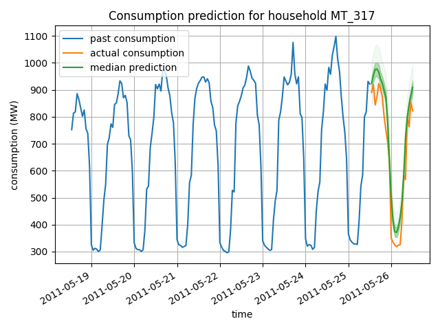
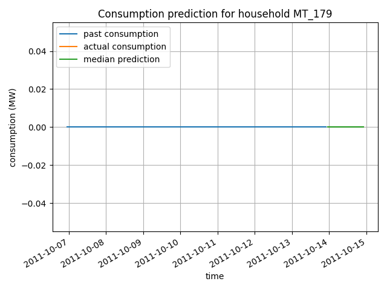

# Multi-Horizon Quantile Regression Forecaster
This is an implementation of the paper [A Multi-Horizon Quantile Recurrent Forecaster](https://arxiv.org/pdf/1711.11053.pdf). The paper describes an endoder decoder quantile regression model for time series prediction. The implementation was tested on electric data consumption dataset. Our model is implemented using Pytorch Lightning

## Predicion Results:

